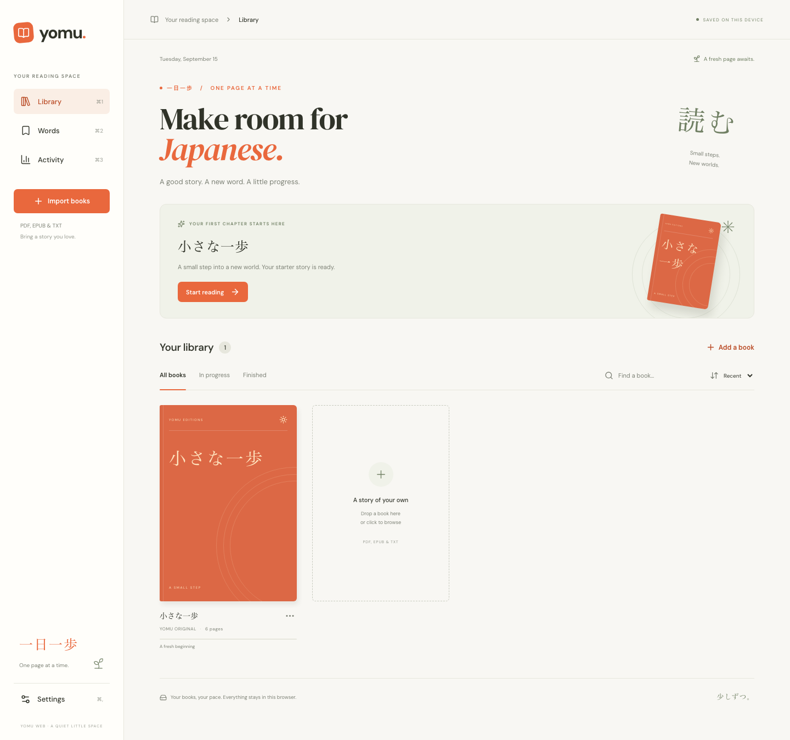

# Yomu Web

A small React version of the Yomu SwiftUI Japanese reading app. Bring a book, read a little, and keep the words you discover. No account, API key, or application backend is needed.



[Dark theme](docs/library-dark.png) · [Mobile library](docs/library-mobile.png) · [Mobile reader](docs/reader-mobile.png)

## Run locally

Use Node **24.15+ (24.x)** or **26+** and npm.

```sh
npm ci
npm run dev
```

Open **http://127.0.0.1:5173**. The original six-page Japanese story, **小さな一歩**, is included, so you can start reading immediately. Installation copies PDF.js support files into `public/pdfjs/` and the OCR worker, WebAssembly engines, and Japanese models into `public/ocr/`. These assets are regenerated from locked dependencies rather than checked into Git. Run `npm ci` after updating an older checkout to install the OCR dependencies and prepare these files.

```sh
npm run build    # Type-check and build into dist/
npm run preview  # Serve the production build locally
```

The `dist/` directory can be served by a static web host. Keep its `dictionary/`, `pdfjs/`, `ocr/`, and `assets/` directories. Serve from the site root, or set Vite's `base` before building for a subdirectory. Use the same host and port when reopening your library: browser storage belongs to an origin, so `localhost`, `127.0.0.1`, and different ports have separate libraries.

## What works

- **Library:** import PDF, EPUB, TXT, CBZ/ZIP comics, and PNG/JPEG/WebP pages, including drag and drop. Selecting multiple loose images imports them as one manga, sorted naturally (`1`, `2`, `10`). Search, sort, filter by progress, mark books finished, and remove books. EPUB covers and manga thumbnails are used when available.
- **Reader:** Japanese novels default to vertical columns: top to bottom, then right to left. Scroll the wheel or pan horizontally to continue across columns. Settings → **Text direction** switches to horizontal reading and remembers your choice. Resume your page, jump to another page/chapter, and set a reading goal. Automatic scrolling and page turns for reflowed text run at 30–600 characters/minute (120 by default). Selecting text, manual scrolling, opening a reader dialog, and switching away pause reading.
- **Manga:** retain page artwork and turn pages right to left. Scanned pages are recognized when opened, with progress, cancellation, retry, and saved results. Tap a detected text area or select words in the transcript to use the dictionary, highlights, vocabulary, and quizzes. **Select speech bubble** scans a dragged rectangle; **Edit page text** corrects recognition errors. Original-image reading uses manual page turns so OCR length never rushes you past a panel.
- **Dictionary:** select text and choose **Look up**, or use the reader's search button. See readings, English meanings, parts of speech, alternate entries, and individual kanji on’yomi/kun’yomi. Common polite, past, negative, and te forms are handled. Pronunciation uses a Japanese speech voice available in your browser.
- **Highlights and words:** highlight passages and revisit them from the reader's bookmark button. Save words with their source sentence, book title, and page. Search, listen to, practice, or remove saved words. Saved words and finished session history remain after deleting a book.
- **Quizzes:** finish a session to practice readings and meanings from visited pages. Looked-up and saved words are prioritized, followed by highlighted vocabulary and words extracted from the text. Answers, corrections, context, and missed words appear in the results. Saved vocabulary can be practiced independently.
- **Activity:** pages visited, active reading minutes, daily streak, a seven-day chart, session history, and quiz results.
- **Appearance:** responsive desktop/mobile layouts, system/light/dark themes, and persistent pace and text size.

### Shortcuts

| Shortcut                                      | Action                                        |
| --------------------------------------------- | --------------------------------------------- |
| ⌘/Ctrl + O                                    | Import books                                  |
| ⌘/Ctrl + 1 / 2 / 3                            | Library / Words / Activity                    |
| ⌘/Ctrl + ,                                    | Settings                                      |
| Space in the reader                           | Pause/resume, when focus is outside a control |
| Left / right arrow in vertical books or manga | Next / previous page                          |
| Right / left arrow in horizontal books        | Next / previous page                          |

### Manga OCR

Import a CBZ/ZIP, scanned PDF, image EPUB, or page images, then open it normally. OCR runs on the current page only; it does not block importing an entire volume. Both the engine and language data are served from Yomu, and recognition runs in a browser worker. No book images are sent to an OCR service. The first scan loads several megabytes of local model/engine assets; language data is then cached by the browser.

If a full-page scan misses dialogue, choose **Select speech bubble** and drag around just that bubble. Use **Text direction → Horizontal** for horizontal dialogue, then scan the page or bubble again. Correct the transcript with **Edit page text** when necessary. Matching highlights are reanchored after corrections; highlights whose text was removed are dropped. Saved vocabulary and its source sentences remain unchanged.

This uses [Tesseract.js](https://github.com/naptha/tesseract.js) with the `jpn` and `jpn_vert` models. It fits the existing static app and offers local page detection and bounding boxes. [manga-ocr](https://github.com/kha-white/manga-ocr) is specialized for manga speech bubbles, but its standard setup requires Python/PyTorch and a model download; integrating that would add a separate service. Tesseract recognition and automatic bubble ordering are approximate, especially for furigana, stylized lettering, overlapping art, and unusual panel layouts. Cropping and transcript corrections remain available.

## Browser version boundaries

This is a simple web adaptation, with these differences from the native app:

- Books, OCR text, covers, progress, highlights, vocabulary, and sessions are stored in **IndexedDB**. Imported PDFs and manga page images are retained in a separate asset store, so progress saves do not rewrite the artwork. Removing a book also removes its assets. Older libraries are upgraded in place. Clearing site data removes the library; there is no export, cloud sync, or cross-device backup. Use one tab for editing the library.
- Reading position is saved when you visit a page. A session is recorded when you choose **Library** or **Finish & quiz**; closing or reloading the reader first does not record that unfinished session. Page totals count unique pages visited within each session, including manually visited pages. Minutes count time while paced reading is running.
- **PDF:** one logical page per original PDF page, with selectable-text reflow and an **Original page** view. Vertical text identified by PDF font/direction metadata is grouped into columns and read top to bottom, right to left. Complex layouts and rotated/mixed-direction text may still need the original view. Scanned pages retain their artwork and support OCR. Japanese character maps are bundled. Outlines and password-protected documents are unsupported. **Reimport PDFs added by an older Yomu version** to get original pages, OCR, and improved extraction; earlier imports did not retain source files.
- **EPUB:** stored/deflated ZIP files, XML/XHTML chapters, spine order, metadata, common cover metadata, and ruby removal. Raster images in XHTML or SVG wrappers become image pages, including image-only manga. In mixed chapters, extracted text precedes the chapter's illustrations; complex publisher layouts and SVG-only artwork are not reproduced. Encrypted content is rejected; font obfuscation alone is allowed. Invalid XML, unsupported compression, duplicate/traversing ZIP paths, and corrupt archive content are rejected. Embedded HTML is never rendered in the app.
- **Comics:** CBZ and ZIP archives with naturally sorted PNG/JPEG/WebP pages. Nested folders work; hidden files and macOS archive metadata are ignored. CBR/RAR, encrypted comics, and other image formats are unsupported.
- **TXT:** UTF-8, BOM-marked UTF-16, or Shift-JIS. TXT and EPUB use logical pages of roughly 650 Unicode characters.
- Import limits: **75 MB per source**, **16 MB per ZIP/EPUB member**, **200 MB total expanded archive content or grouped images**, **fewer than 5,000 ZIP members/grouped images**, and **5,000 PDF pages**. Images above **40 megapixels** are rejected when decoded; reading canvases use at most 2,400 pixels on the long edge. Browser/device memory and storage quotas can impose lower practical limits.
- Lookup includes the full bundled dictionary; automatic quiz extraction uses common entries and browser Japanese segmentation. It is a learning aid with limited inflection rules, not contextual translation or JLPT assessment. Explicitly saved or looked-up uncommon entries can be quizzed too.
- The app, fonts, PDF support, OCR engines/models, and dictionary are served locally; imported text and images are not uploaded to an application service. Your browser's speech implementation may use a platform speech service. Actual Japanese audio requires an installed/available Japanese voice.
- This is a static web app, not an installed offline PWA. Keep the local server running, or access the hosted site. Dictionary files are loaded as needed from that same server.

## Verification

```sh
npm test
npx playwright install chromium --only-shell
npm run test:e2e
```

- **Unit tests:** Japanese text encodings, Unicode pagination, vertical PDF column order, comic ordering and asset separation, archive validation, OCR text cleanup/bubble ordering, dictionary lookup, inflections, and quiz answer correctness.
- **Chromium browser tests:** desktop and mobile viewports cover the full reading/study flow, vertical geometry and scrolling, direction preferences, real Japanese image and scanned-PDF OCR, bubble selection, OCR failure/retry, saved transcripts/highlights, comic/image-EPUB/loose-image imports, asset deletion, and upgrading an existing library. OCR tests use original synthetic manga artwork with real Japanese pixels and the actual local engine, without mocking recognition.
- Production TypeScript/Vite build. Desktop and mobile light/dark layouts reviewed. Mobile checks use Chromium emulation; physical iOS/Safari and audible speech remain manual checks.

GitHub Actions runs the build and both test suites on pushes and pull requests. A custom Chromium binary can be selected with `YOMU_CHROMIUM_PATH`. Set `PLAYWRIGHT_BROWSERS_PATH` for both installation and tests if using a separate browser cache.

## Project layout

| Path                             | Purpose                                                           |
| -------------------------------- | ----------------------------------------------------------------- |
| `src/App.tsx`                    | Navigation, library state, import and reading flows               |
| `src/components/`                | Library, reader, dictionary, vocabulary, quiz, activity, settings |
| `src/lib/`                       | IndexedDB persistence, document import, dictionary, quiz logic    |
| `src/styles.css`                 | Responsive styling and light/dark themes                          |
| `src/sample.ts`                  | Original six-page story adapted from the Swift app                |
| `public/dictionary/`             | Complete compressed dictionary, metadata, and license             |
| `scripts/export-assets.py`       | Re-export story and dictionary from the Swift app                 |
| `scripts/prepare-pdf-assets.mjs` | Copy installed PDF.js support files for local serving             |
| `scripts/prepare-ocr-assets.mjs` | Copy locked OCR engines and Japanese models for local serving     |
| `tests/`                         | Browser flows and small original import fixtures                  |

Built with React, TypeScript, and [Vite](https://vite.dev/guide/), using [PDF.js](https://mozilla.github.io/pdf.js/), [fflate](https://github.com/101arrowz/fflate), IndexedDB via `idb`, Lucide icons, and locally served DM Sans/DM Serif Display fonts. No UI framework, router, authentication, or backend is required. Run `npm run format` to format source files.

## Dictionary attribution

**JMdict and KANJIDIC2**, copyright © James William BREEN and the **Electronic Dictionary Research and Development Group (EDRDG)**, are used under **Creative Commons Attribution-ShareAlike 4.0**. The compressed JSON adaptations remain under this license. See [the bundled license](public/dictionary/LICENSE.txt), [EDRDG's license](https://www.edrdg.org/edrdg/licence.html), and Settings → Dictionary sources & licenses.

The September 15, 2026 snapshot includes **324,835 word/reading pairs** and **13,108 kanji**. Common entries load together; uncommon entries are split into 64 local lookup files. The dictionary is approximately **15.6 MB compressed** in total. Readings, meanings, and word/reading restrictions are preserved from the Swift database.

To regenerate from the neighboring Swift project after refreshing its dictionary:

```sh
python3 scripts/export-assets.py ../JapeneseApp
npm run format
npm test
```

No sibling project is needed for normal installation or development. The native app's original story and test EPUB/TXT fixtures are reused. Generated PDF fixtures are small original test documents. Dictionary and dependency licenses do not assign a license to the app's source code or to books you import.
