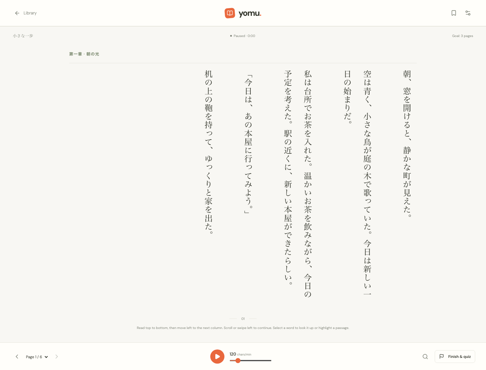
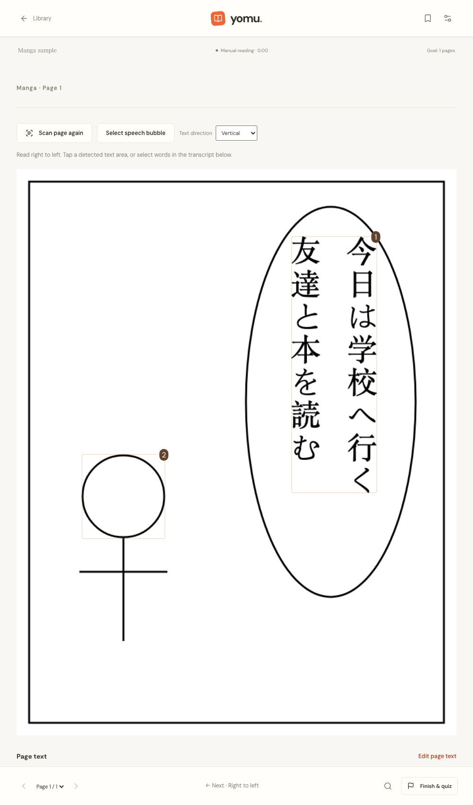
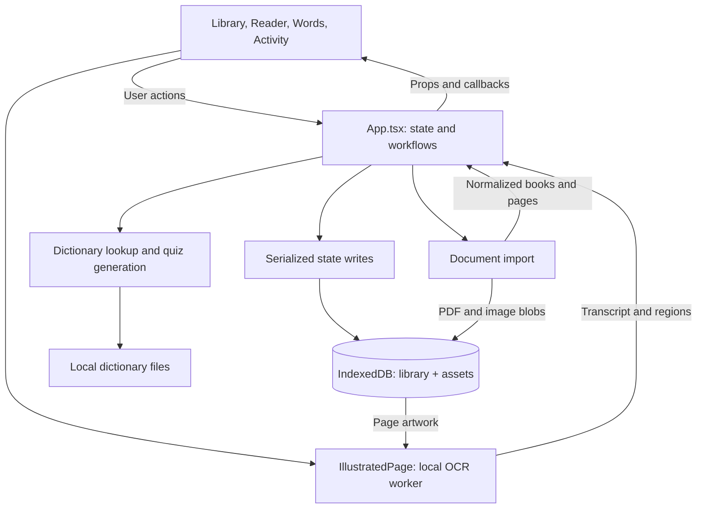

# Yomu Web

**Read Japanese. Keep the context. Practice what you discover.**

Yomu is a personal project that brings Japanese reading, dictionary lookup, and vocabulary practice into one browser app. It adapts a SwiftUI reading app to React and TypeScript, with vertical reading for novels and limited, local OCR for manga and scanned pages.

Import a book, look up unfamiliar words without leaving the reader, and turn a reading session into a quiz. Books and study progress stay in your browser; no account, API key, or application backend is required.

[Get started](#get-started) · [Features](#features) · [Tech stack](#tech-stack) · [Architecture](#architecture) · [Design decisions](#design-decisions) · [Verification](#verification)


[Dark theme](docs/library-dark.png) · [Mobile library](docs/library-mobile.png) · [Mobile reader](docs/reader-mobile.png)

## Features

| Read                                               | Study                                                 | Return                                                 |
| -------------------------------------------------- | ----------------------------------------------------- | ------------------------------------------------------ |
| Import PDF, EPUB, TXT, CBZ/ZIP, and page images    | Look up Japanese words, readings, meanings, and kanji | Resume your saved page and reading preferences         |
| Read vertical columns or switch to horizontal text | Save words with their sentence, book, and page        | Revisit highlights and practice saved vocabulary       |
| Keep manga artwork and recognize text locally      | Quiz words from the pages you visited                 | Track sessions, pages visited, and active reading time |

### Vertical Japanese reading

Novels default to **top-to-bottom, right-to-left** columns. Mouse-wheel input moves across columns; page controls and arrow keys follow the reading direction. **Settings → Text direction** switches to horizontal reading and remembers the preference. Reflowed text supports adjustable pacing, text size, and reading goals.



### Manga and scanned pages · limited OCR

CBZ/ZIP comics, image EPUBs, scanned PDFs, and PNG/JPEG/WebP pages retain their artwork. OCR runs on the current page in a browser worker, and the transcript connects to the same dictionary, highlights, saved words, and quizzes as ordinary text. Multiple loose images become one naturally ordered book.

Recognition is approximate: furigana, stylized lettering, overlapping artwork, and unusual panel order can produce mistakes. **Select speech bubble** narrows the scan, **OCR text direction** selects the recognition orientation, and **Edit page text** lets you correct the transcript. Manga uses manual page turns, so OCR text length does not determine how long a panel stays open.

<details>
<summary>View local OCR on an original manga test page</summary>



</details>

Screenshots come from isolated Chromium browser sessions. The manga example is original test artwork, not a recognition-quality benchmark. See the [reading and import guide](docs/reading-and-imports.md) for formats, shortcuts, OCR controls, and size limits.

## Tech stack

| Layer          | Technology                                          | Role in Yomu                                                                     |
| -------------- | --------------------------------------------------- | -------------------------------------------------------------------------------- |
| Interface      | React 19, TypeScript, custom CSS                    | Typed components, responsive layouts, vertical typography, and light/dark themes |
| Build          | Vite                                                | Development server, production bundles, and deferred PDF/OCR modules             |
| Persistence    | IndexedDB with `idb`                                | Browser-local books, progress, vocabulary, sessions, and image/PDF blobs         |
| Documents      | PDF.js, `fflate`, browser XML and image APIs        | PDF text/rendering, EPUB/CBZ archives, and page images                           |
| OCR            | Tesseract.js, WebAssembly, `jpn` / `jpn_vert`       | Local Japanese recognition with text-region coordinates                          |
| Language tools | JMdict, KANJIDIC2, `Intl.Segmenter`, Web Speech API | Dictionary lookup, vocabulary extraction, kanji readings, and pronunciation      |
| UI assets      | Lucide, locally served DM Sans / DM Serif Display   | Icons and interface typography                                                   |
| Verification   | Vitest, Playwright, GitHub Actions                  | Logic tests, browser workflows, type checking, and CI                            |

Exact dependency versions are pinned in [package.json](package.json) and [package-lock.json](package-lock.json).

## Architecture



[App.tsx](src/App.tsx) owns shared data and workflows; components keep transient controls such as search queries and selections. A pending snapshot and a promise queue serialize saves so rapid updates build on one another. [storage.ts](src/lib/storage.ts) keeps the library snapshot separate from large PDF/image blobs, so changing a page or saving a word does not rewrite the artwork.

[Reader.tsx](src/components/Reader.tsx) bridges browser text selection to page-relative offsets for lookup and highlights. [IllustratedPage.tsx](src/components/IllustratedPage.tsx) adds page rendering, cancellable recognition, bubble selection, and transcript correction. These paths feed the same vocabulary and quiz model.

## Design decisions

### Why IndexedDB instead of PostgreSQL?

The current product is a personal library on one browser. [IndexedDB](https://developer.mozilla.org/en-US/docs/Web/API/IndexedDB_API) provides asynchronous, transactional storage for structured data and blobs directly in that browser. That fits books and manga pages while keeping the app deployable as static files.

| Option                       | Fit for this project                                                                                                                                                         |
| ---------------------------- | ---------------------------------------------------------------------------------------------------------------------------------------------------------------------------- |
| **IndexedDB**                | Stores structured records and binary assets locally, with transactions and no database server to operate.                                                                    |
| **localStorage**             | Useful for small preferences; synchronous string storage is a poor fit for a library of books and images.                                                                    |
| **PostgreSQL behind an API** | A sensible future option for accounts, shared data, and cross-device sync; it would introduce an application service, access control, hosting, and a synchronization design. |

PostgreSQL's [client/server architecture](https://www.postgresql.org/docs/current/tutorial-arch.html) solves a different deployment need. Choosing IndexedDB here is about where the data lives and what the app currently needs, not a claim that it replaces a server database in every system.

The tradeoff is responsibility for local data: storage is specific to the browser and origin, subject to [browser quotas and eviction](https://developer.mozilla.org/en-US/docs/Web/API/Storage_API/Storage_quotas_and_eviction_criteria), and lost if site data is cleared. There is no export, cloud backup, cross-device sync, or multi-tab conflict handling yet. The library still saves as one snapshot; separating artwork reduces write size, but larger text libraries may eventually justify finer-grained records.

### Why local OCR?

[Tesseract.js](https://github.com/naptha/tesseract.js) fits the static app: its worker, WebAssembly engines, and Japanese models are served from the same site, and book images are processed on the device. It provides bounding boxes for clickable text regions. Recognition starts when a page is opened, so import does not wait for an entire volume to be scanned.

The cost is model loading, device CPU/memory use, and limited accuracy on manga. Cropping, retry, cancellation, and transcript editing are part of the workflow. There is no specialized manga recognition service or automatic translation.

### Why a bundled dictionary?

Lookup works without a dictionary account or API key. Common entries load together; uncommon entries are split into 64 files and fetched as needed. This keeps broad vocabulary coverage without loading the full dictionary for every lookup. Inflection handling uses limited rules, and automatic quiz extraction uses common vocabulary rather than contextual translation.

## Get started

Use **Node 24.15+ within 24.x, or Node 26+**, and npm.

```sh
npm ci
npm run dev
```

Open **http://127.0.0.1:5173**. The original six-page Japanese story, **小さな一歩**, is included. Start reading, select **朝**, look it up, save it, then use **Finish & quiz** to try the study loop.

Installation prepares PDF.js support files in `public/pdfjs/` and OCR assets in `public/ocr/` from locked dependencies. Run `npm ci` after updating an older checkout. No sibling project is needed for normal development.

```sh
npm run build    # Type-check and build into dist/
npm run preview  # Serve the production build locally
```

Deploy `dist/` to a static host with its `assets/`, `dictionary/`, `pdfjs/`, and `ocr/` directories intact. Set Vite's `base` before building for a subdirectory. Reopen the same origin to access your library: `localhost`, `127.0.0.1`, and different ports have separate storage.

## Verification

```sh
npm test
npx playwright install chromium --only-shell
npm run test:e2e
```

- **Vitest:** encodings, Unicode pagination, archive validation, vertical PDF column order, comic ordering, OCR text cleanup and region ordering, dictionary lookup, and quiz correctness.
- **Playwright:** desktop and mobile Chromium flows cover reading, saved progress, vocabulary, quizzes, vertical layout, real Japanese OCR, bubble selection, corrections, failure/retry, image imports, asset deletion, and upgrading an existing library.
- **GitHub Actions:** runs unit tests, the TypeScript/Vite build, and browser tests on pushes and pull requests.

The documentation refresh was checked with **25 passing unit tests across 5 files**, **24 passing browser executions across 12 scenarios and 2 viewports**, and a successful production build. OCR tests use Japanese pixels and the actual local engine. Mobile coverage is Chromium emulation; physical iOS/Safari and audible speech remain manual checks.

Use `YOMU_CHROMIUM_PATH` for a custom Chromium binary. If using a separate browser cache, set `PLAYWRIGHT_BROWSERS_PATH` for both installation and tests.

## Current boundaries and next steps

- **Local data:** no backup/export or sync; use one tab for editing. Clearer save-failure handling, backup, and deeper storage validation are useful next steps.
- **Reading metrics:** position saves as you visit pages; session history saves on **Library** or **Finish & quiz**. Closing the reader first loses the unfinished session. Minutes measure active paced reading, so manually read manga does not accrue paced-reading time.
- **Document fidelity:** PDF originals are retained alongside extracted text. Complex layouts and vertical extraction can still need the original view. Reimport PDFs saved by older versions to enable artwork and OCR. EPUB text is reflowed; publisher layouts and SVG-only artwork are not reproduced.
- **Availability:** this is a static web app, not an installed offline PWA. Assets and dictionary files need the serving origin. Browser speech may use a platform service and requires an available Japanese voice.

Full compatibility details and import limits are in [Reading, imports, and browser storage](docs/reading-and-imports.md).

## Explore the code

| Path                                                     | Responsibility                                                                      |
| -------------------------------------------------------- | ----------------------------------------------------------------------------------- |
| [src/App.tsx](src/App.tsx), [src/types.ts](src/types.ts) | Application workflows, state coordination, and domain contracts                     |
| [src/components/](src/components/)                       | Library, reader, illustrated pages, lookup, vocabulary, quizzes, activity, settings |
| [src/lib/](src/lib/)                                     | Storage, importers, PDF/image processing, OCR, dictionary, and quiz logic           |
| [src/styles.css](src/styles.css)                         | Responsive layout, vertical typography, and themes                                  |
| [public/dictionary/](public/dictionary/)                 | Compressed dictionary, metadata, and attribution                                    |
| [scripts/](scripts/)                                     | Local PDF/OCR asset preparation and native dictionary/story export                  |
| [tests/](tests/)                                         | Browser journeys and original import fixtures                                       |

Run `npm run format` to format the source. A useful code-reading path is **types → App → Reader / IllustratedPage → storage and language tools → tests**.

## Dictionary and asset attribution

**JMdict and KANJIDIC2**, copyright © James William BREEN and the **Electronic Dictionary Research and Development Group (EDRDG)**, are used under **Creative Commons Attribution-ShareAlike 4.0**. The compressed JSON adaptations remain under this license. See [the bundled license](public/dictionary/LICENSE.txt), [EDRDG's license](https://www.edrdg.org/edrdg/licence.html), and Settings → Dictionary sources & licenses.

The September 15, 2026 snapshot includes **324,835 word/reading pairs** and **13,108 kanji**, approximately **15.6 MiB compressed**. Readings, meanings, and word/reading restrictions are preserved from the native database.

To refresh the dictionary and original story from the neighboring Swift project:

```sh
python3 scripts/export-assets.py ../JapeneseApp
npm run format
npm test
```

Font notices are in [public/licenses/](public/licenses/). The native app's story and EPUB/TXT fixtures are reused; generated PDF and manga fixtures are original test material. Dependency and dictionary licenses do not assign a license to the app's source code or to imported books.
